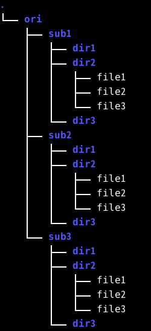
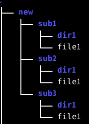
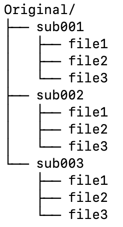
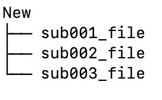

# shell_scripts <!-- omit in toc -->
Shell scripts for daily use.
Mainly related to brain image analysis.

## Table of Contents <!-- omit in toc -->

- [syncview](#syncview)
- [timelog](#timelog)
- [change\_intensity.sh](#change_intensitysh)
- [new\_datadir.sh](#new_datadirsh)
  - [example](#example)
- [rename\_files\_after\_foldername.sh](#rename_files_after_foldernamesh)
- [gif\_movie\_to\_still.sh](#gif_movie_to_stillsh)
- [png\_tilemake.sh](#png_tilemakesh)


## syncview

**prerequisite : Mrtrix3 and zenity**

You can view nii and mif files in multiple windows with syncronized slice position (if they were performed at the same position and date)

**usage**

You can see help with this command.

```syncview h```

## timelog

**prerequisite : nothing special**

**usage**

```timelog your_script_to_record_time```

You can measure and record runtime of your script in timelog.txt, which is generated in the working directory.

## change_intensity.sh

**prerequisite : FSL (any version)**

**usage**

```Usage : change_intensity.sh Image.nii (or Image.nii.gz)```

You can specify Minimum and Maximum intensity of nifti image.

## new_datadir.sh

**prerequisite : nothing special**


被験者データの中から特定のファイルやディレクトリを集めて新たなデータディレクトリを作成します。同じデータを使って別の解析をやりたい時、もしくは途中から解析をやり直したい時に便利です。

スクリプト内に「変数」という項目があり、元となる被験者データのディレクトリ、その中の何をコピーするか、新しい被験者データのディレクトリをそれぞれ指定できるようになっています。ご自分の環境に合わせてこの部分を書き換えてください。コピーするディレクトリ名、ファイル名は半角スペースで区切って()の中に記載します。

その後このレポジトリをクローンしたディレクトリに移動して下記で行うと実行されます。

Create a new data directory by collecting specific files or directories from the subject data. This is useful when you want to do another analysis using the same data, or when you want to start over in the middle of an analysis.

There is a "Variables" section in the script that allows you to specify the original subject data directory, what to copy in it, and the new subject data directory, respectively. Please rewrite this section to suit your environment.

After that, move to the directory (clone of this repository) and execute ：

```bash
cd ~/git/shell_scripts
./new_datadir.sh
```
### example

If you have file tree like this:



And if you want dir1 and dir2/file1 to be copied, modify variables like:

```bash
###--------------------Variables---------------------###
original_directory=~/ori
new_directory=~/new
f_and_d=(dir1 dir2/file1)
########################################################
```


## rename_files_after_foldername.sh
**prerequisite : nothing special**

これはフォルダーの名前をとってファイル名にするスクリプトです。例えばTBSSを行うために各被験者のFA.nii.gzを集めるのに使えます。使い方は次の例を見てください。

例：
今Originalフォルダ内に被験者sub001-sub003のフォルダがあります。各フォルダ内には同名のファイル、file1-3が含まれています。もし全てのfile1を１つのフォルダ（Newフォルダ）に集めたい場合、同名のファイルは上書きされてしまうため、各ファイルに被験者名をつけることができます。

This is a script that takes the name of a folder and use it as a file name. For example, it can be used to collect FA.nii.gz for each subject in order to perform TBSS. See the following example for how to use it.

Example: In the Original folder, there are folders named after the subjects sub001-sub003. Each folder contains files with the same name, file1-3. If you want to collect all file1 into one folder (New folder), you may give each file a subject name, since files with the same name will be overwritten.




スクリプト内に「変数」という項目があり、元となるフォルダ、その中の何をコピーするか、新しいフォルダ、新しい名前をそれぞれ指定できるようになっています。ご自分の環境に合わせてこの部分を書き換えてください。

There is a "Variables" section in the script that allows you to specify the original folder, what to copy in it, the new folder, and the new name, respectively. Please rewrite this section to suit your environment.

```
#-------------書き換える部分はここから-------------------#
#==================Variables=========================#
original_dir=~/Original
file_name=file1
new_dir=~/New
new_name=file
#-------------------ここまで---------------------------#
```

その後このレポジトリをクローンしたディレクトリ（例えば~/git/shell_scripts）に移動して下記をタイプすると実行されます。

Then go to the directory where you cloned this repository (e.g. ~/git/shell_scripts) and type the following to execute.

```bash
cd ~/git/shell_scripts
./rename_files_after_foldername.sh
```

出来上がったNewフォルダは以下のようになります。

The resulting New folder will look like this



## gif_movie_to_still.sh

**prerequisite : ImageMagick(https://imagemagick.org/index.php)**

**usage**

```
cd directory_with_animated_gif
png_tilemake.sh

```

This script does frame decomposition of animated gif.
Prepare animatd gif(s) in the current working directory.

このスクリプトはアニメーションGIFのフレーム分解を行います。
カレントディレクトリにanimatd gifを用意します。


## png_tilemake.sh

**prerequisite : FSL**

**usage**

```png_tilemake.sh```

Create tile-like images from png images. Each tile can contain 2-6 images. The name of the image must contain a 4-digit serial number starting with 0000. For example, "image0001.png" or "DWI_0100.png". If you decompose an animated gif that can be saved in fsleyes with gif_movie_to_still.sh in this repository, or if you save an image in mrview, it will be given a name that matches the criteria by default.

png画像からタイル状の画像を作成します。
一枚のタイルに2−6枚の画像を並べることができます。
画像の名前は0000から始まる4桁の通し番号を含んでいる必要があります。例えば「image0001.png」 や 「DWI_0100.png」などです。
fsleyesで保存できるanimated gifをこのレポジトリにあるgif_movie_to_still.shで分解したり、mrviewで画像を保存した場合、デフォルトで条件に合った名前をつけてくれます。