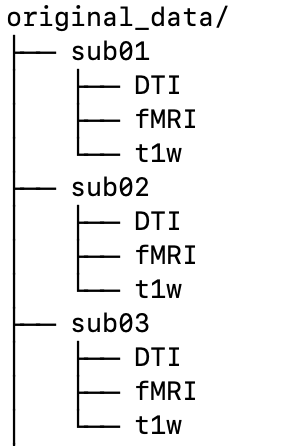
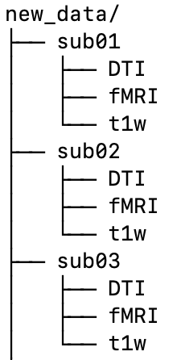

# shell_scripts
Shell scripts for daily use.

Mainly related to brain image analysis.

## syncview

**prerequisite for syncview: Mrtrix3 and zenity.**

You can view nii and mif files in multiple windows with syncronized slice position (if they were performed at the same position and date)

**usage**

You can see help with thin command.

```syncview h```

## timelog

**prerequisite for timelog: nothing special**

**usage**

```timelog your_script_to_record_time```

You can measure and record runtime of your script in timelog.txt, which is generated in the working directory.

## change_intensity.sh

**prerequisite for change_intensity.sh: FSL (any version)**

**usage**

```Usage : change_intensity.sh Image.nii (or Image.nii.gz)```

You can specify Minimum and Maximum intensity of nifti image.

## new_datadir.sh

**prerequisite: nothing special**


被験者データの中から特定のファイルやディレクトリを集めて新たなデータディレクトリを作成します。同じデータを使って別の解析をやりたい時、もしくは途中から解析をやり直したい時に便利です。

スクリプト内に「変数」という項目があり、元となる被験者データのディレクトリ、その中の何をコピーするか、新しい被験者データのディレクトリをそれぞれ指定できるようになっています。ご自分の環境に合わせてこの部分を書き換えてください。

その後このレポジトリをクローンしたディレクトリに移動して下記で行うと実行されます。

Create a new data directory by collecting specific files or directories from the subject data. This is useful when you want to do another analysis using the same data, or when you want to start over in the middle of an analysis.

There is a "Variables" section in the script that allows you to specify the original subject data directory, what to copy in it, and the new subject data directory, respectively. Please rewrite this section to suit your environment.

After that, move to the directory (clone of this repository) and execute ：

```bash
cd ~/git/shell_scripts
./new_datadir.sh
```



