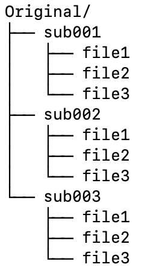

# shell_scripts <!-- omit in toc -->
よく使う便利なシェルスクリプトです。主に脳画像解析関連です。

## Table of Contents <!-- omit in toc -->

- [syncview](#syncview)
- [timelog](#timelog)
- [change\_intensity.sh](#change_intensitysh)
- [new\_datadir.sh](#new_datadirsh)
  - [example](#example)
- [rename\_files\_after\_foldername.sh](#rename_files_after_foldernamesh)
- [gif\_movie\_to\_still.sh](#gif_movie_to_stillsh)
- [png\_tilemake.sh](#png_tilemakesh)
- [label\_list\_maker.sh](#label_list_makersh)
- [first.sh](#firstsh)


## syncview

**前提条件 : Mrtrix3 and zenity**

フォルダからファイルを選択してniftiファイルやmifファイルを同時に複数開きます。放射線科のビューアーのように同期して動かすことができます。同一の座標空間であれば同一の位置で同期されます。

**使用法**

詳しい使い方については次のようにしてヘルプをご覧ください。

```syncview h```

## timelog

**前提条件 : 特になし**

**使用法**

```timelog your_script_to_record_time```

スクリプトの実行時間を測定してタイムログを残します。

## change_intensity.sh

**前提条件 : FSL (any version)**

**使用法**

```使用法 : change_intensity.sh Image.nii (or Image.nii.gz)```

Niftiファイルの信号値を上限、下限の値の間にスケーリングし直します。

## new_datadir.sh

**前提条件 : 特になし**


被験者データの中から特定のファイルやディレクトリを集めて新たなデータディレクトリを作成します。同じデータを使って別の解析をやりたい時、もしくは途中から解析をやり直したい時に便利です。

スクリプト内に「変数」という項目があり、元となる被験者データのディレクトリ、その中の何をコピーするか、新しい被験者データのディレクトリをそれぞれ指定できるようになっています。ご自分の環境に合わせてこの部分を書き換えてください。コピーするディレクトリ名、ファイル名は半角スペースで区切って()の中に記載します。

その後このレポジトリをクローンしたディレクトリに移動して下記で行うと実行されます。


```bash
cd ~/git/shell_scripts
./new_datadir.sh
```
### example

ディレクトリ構造が以下のようである場合、


もしdir1とdir2/file1 をコピーしたければ変数を次のように変更します。

```bash
###--------------------Variables---------------------###
original_directory=~/ori
new_directory=~/new
f_and_d=(dir1 dir2/file1)
########################################################
```


## rename_files_after_foldername.sh
**前提条件 : 特になし**

これはフォルダーの名前をとってファイル名にするスクリプトです。例えばTBSSを行うために各被験者のFA.nii.gzを集めるのに使えます。使い方は次の例を見てください。

例：
今Originalフォルダ内に被験者sub001-sub003のフォルダがあります。各フォルダ内には同名のファイル、file1-3が含まれています。もし全てのfile1を１つのフォルダ（Newフォルダ）に集めたい場合、同名のファイルは上書きされてしまうため、各ファイルに被験者名をつけることができます。




スクリプト内に「変数」という項目があり、元となるフォルダ、その中の何をコピーするか、新しいフォルダ、新しい名前をそれぞれ指定できるようになっています。ご自分の環境に合わせてこの部分を書き換えてください。

```
#-------------書き換える部分はここから-------------------#
#==================Variables=========================#
original_dir=~/Original
file_name=file1
new_dir=~/New
new_name=file
#-------------------ここまで---------------------------#
```

その後このレポジトリをクローンしたディレクトリ（例えば~/git/shell_scripts）に移動して下記をタイプすると実行されます。

```bash
cd ~/git/shell_scripts
./rename_files_after_foldername.sh
```

出来上がったNewフォルダは以下のようになります。


## gif_movie_to_still.sh

**前提条件 : ImageMagick(https://imagemagick.org/index.php)**

**使用法**

```
cd directory_with_animated_gif
png_tilemake.sh

```

このスクリプトはアニメーションGIFのフレーム分解を行います。
カレントディレクトリにanimatd gifを用意します。複数あっても大丈夫です。それぞれのフォルダを作成してその中に分解された画像が入ります。元画像はoriginal_gifsというフォルダに入ります。デフォルトではpng形式で保存されるので、gifが欲しい場合はコメントアウトを入れ替えて下さい。


## png_tilemake.sh

**前提条件 : FSL**

**使用法**

```
png_tilemake.sh
```

png画像からタイル状の画像を作成します。
一枚のタイルに2−6枚の画像を並べることができます。
画像の名前は0000から始まる4桁の通し番号を含んでいる必要があります。例えば「image0001.png」 や 「DWI_0100.png」などです。
fsleyesで保存できるanimated gifをこのレポジトリにあるgif_movie_to_still.shで分解したり、mrviewで画像を保存した場合、デフォルトで条件に合った名前をつけてくれます。

## label_list_maker.sh

FSLのアトラスから領域名とインデックスのリストを作ります。実行するとアトラス名のリストが出てくるので、リストがほしいアトラスをコピペで入力してください。
```
./label_list_maker.sh
```

## first.sh

dcm2niixのラッパーです。プロトコル名をつけて変換し、ディレクトリを整理します。

**前提条件 : dcm2niix**

**使用法**

```
cd dicom_directory
first.sh
```

# dobylist.sh スクリプト

## 説明
`dobylist.sh` スクリプトは、指定されたテキストファイルに記載されている各被験者IDに対して指定されたコマンドを実行します。複数の被験者に対して繰り返し行う必要がある作業に対して、バッチ処理タスクとして理想的です。

## 必要条件
- Bash シェル
- スクリプトの実行権限 (`chmod +x dobylist.sh`)

## 使用方法
スクリプトを使用するには、2つの引数を指定する必要があります：
1. 各被験者に対して実行したいコマンド。引数は１つで、被験者IDである必要があります。
2. 被験者IDが記載されたテキストファイルへのパス。

### 構文
```bash
./dobylist.sh <command> <subject_file>
```
